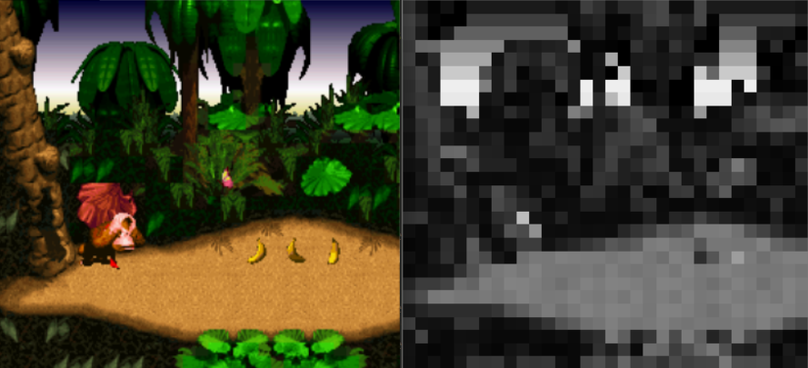

# Donkey Kong Country AI agent

<p align="center"></p>

The Donkey Kong Country AI Bot is an agent reinforcement learning model based on neural networks made for [Redes Neuronales Artificiales (Optativa III FP) AGO-DIC 2019](https://www.fime.uanl.mx/wp-content/uploads/2020/10/Redes-Neuronales-Artificiales-Optativa-III-FP-FIME.pdf) where to objective is to complete the first level of the game.

This project was studied from [Lucas Thompson's](https://twitter.com/lucasrtweeter) channel that uses these packages on handful of old retro videogames and a close demostration can be seen in this [video](https://www.youtube.com/watch?v=X7XqTCiAHio).

The neural network agent was trained in the [Gym Retro](https://github.com/openai/retro/) Enviroment via NeuroEvolution of Augmenting Topologies(NEAT) bsed on the [neat-python](https://github.com/CodeReclaimers/neat-python) library. You can download the project paper [here](https://github.com/BrandonZoft/dkc-ai-bot/raw/master/neural%20network%20DKC%20paper.pdf).

# Installation and training

`pip install -r requirements.txt`


You will need a rom file for Donkey Kong Country and do `python -m retro.import` to import it

go to `site-packages\retro\data\stable\DonkeyKongCountry-Snes` and add this to `data.json`:
```
"x": {
    "address": 8257726,
    "type": "<u2"
  }
```
 
 <p align="center"></p>

`python training.py` to train from zero 

`python training.py #` and replace `#` to train from a generation checkpoint

Happy training!
